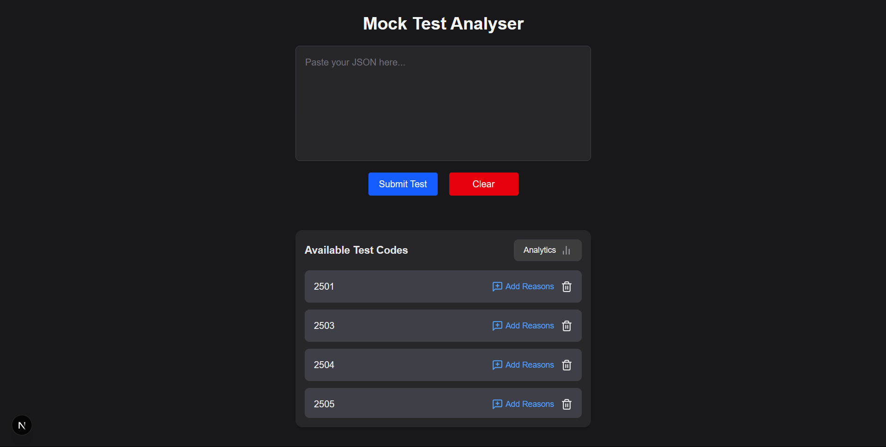
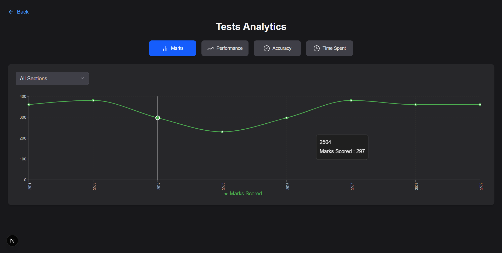
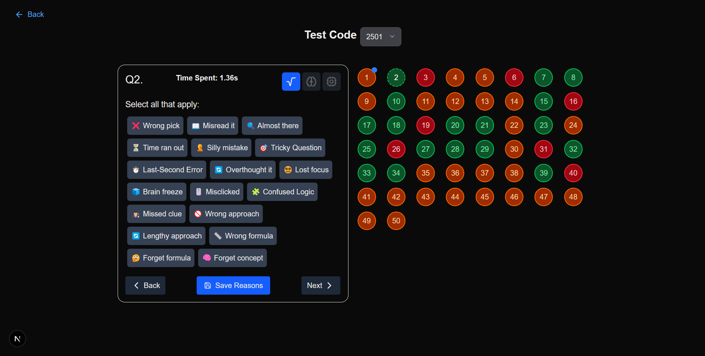

# 📊 Mock Test Result Analyzer

A platform that allows students to analyze their mock test results, track performance, and identify areas for improvement. Built with Next.js, Prisma ORM, SQLite, and TailwindCSS.

---


---

## 🚀 Setup Instructions

Follow these steps to set up the project locally:

### 1. Clone the Repository

```bash
git clone https://github.com/sumit-dey-69/mock-test-analyser
cd mock-test-analyser
```

### 2. Set Up the Database

Create a .env file in the root directory and add the following:

```bash
DATABASE_URL="file:./dev.db"
```
This environment variable tells Prisma where your SQLite database is located.

### 3. Install Dependencies

```bash
<package-manager> install
```

You can use:

- `npm install`
- `pnpm install`
- `yarn install`


### 4. Start the Development Server

```bash
pnpm dev
```

Open [http://localhost:3000](http://localhost:3000) in your browser to view the app! 🚀

---

# 📋 Notes

- `dev.db` is **NOT committed** to Git — Prisma generates it locally.
- If you modify the Prisma schema (`schema.prisma`), run:

```bash
pnpm prisma db push
```

again to update your database.

- Make sure you have **Node.js** installed (preferably latest LTS version).
- If you want to use **pnpm**, install it globally:

```bash
npm install -g pnpm
```

---

# 📂 Project Structure

```bash
/prisma         # Prisma schema and database setup
/app            # App Router folder for routing and pages
/components     # Reusable UI components
/public         # Static assets
/zustand        # Zustand store for managing state
/schema         # Zod schema for validating JSON input
/utils          # Utility functions
```

---

# ✨ Tech Stack

- **Next.js** - React framework for building fast web applications
- **Prisma ORM** - Database toolkit to interact with SQLite
- **SQLite** - Lightweight database for local storage
- **TailwindCSS** - Utility-first CSS framework for styling
- **pnpm** - Fast package manager for faster installs

---

# ⚡ Quick Start

```bash
git clone https://github.com/sumit-dey-69/mock-test-analyser
cd mock-test-analyser
pnpm install
pnpm dlx prisma generate
pnpm prisma db push
pnpm dev
```

---

# 🖼️ Screenshot





---

# 🤝 Contributing

Contributions are welcome! Please open an issue or submit a pull request.

# 📜 License

This project is licensed under the MIT License.
